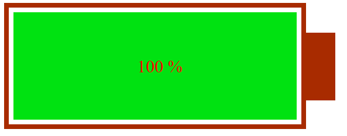

# MriNgxBatteryStatus

This library was generated with [Angular CLI](https://github.com/angular/angular-cli) version 8.2.0.

This library src is available on [GitHub](https://github.com/rezaimn/mri-ngx-battery-status).

## Design your own battery for IOT projects in Angular, Ionic and NativeScript
## Examples





## Installing

     npm i mri-ngx-battery-status --save

## Quickstart

Import mri-ngx-battery-status module in Angular app.

```sh 
     import {MriNgxBatteryStatusModule} from 'mri-ngx-battery-status';

     @NgModule({
       (...)
       imports: [
         MriNgxBatteryStatusModule
       ]
       (...)
     })
```

##Usage

```sh
     <mri-ngx-battery-status
             [height]="20"
             [width]="50"
             [batteryLevel]="79"
             [highThreshold]="66"
             [lowThreshold]="33"
             [batteryBorderColor]="'#000000'"
             [borderRadius]="4"
             [borderThickness]="2"
             [fontSize]="10"
             [textColor]="'#000000'">
     </mri-ngx-battery-status>
```

##Guide

| input | type | description |
| ------ | ------ | ------ |
| height | number | it sets the component height
| width | number | it sets the component width
| batteryLevel | number | it sets the battery level and it must be between 0 and 100
| highThreshold | number | it sets the percentage that we consider the battery level is high
| lowThreshold | number | it sets the percentage that we consider the battery level is low
| batteryBorderColor | string | it sets the battery border color
| borderRadius | number | it sets the border radius
| borderThickness | number | it sets the battery border thickness
| fontSize | number | it sets the battery level text font size
| textColor | string | it sets battery level text color
